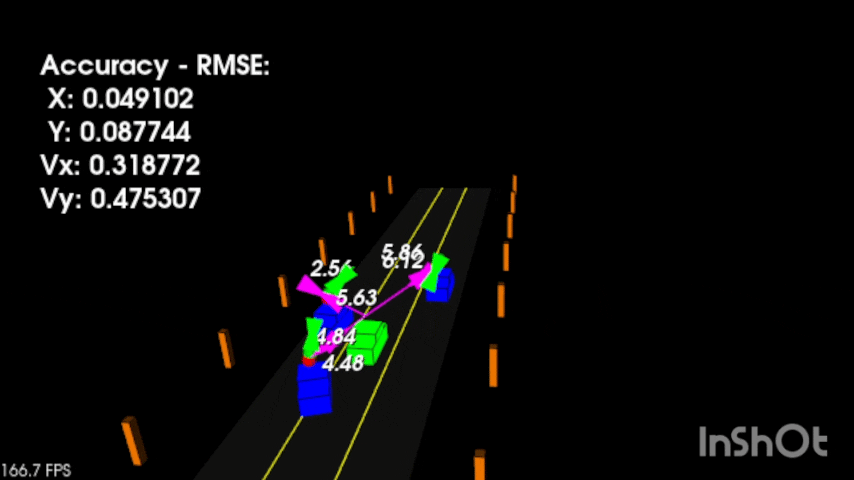

# Sensor Fusion Portfolio

This repository contains projects related to sensor fusion and state estimation for autonomous systems.

The projects were implemented in C++ and focus on Kalman filtering techniques used in robotics and autonomous driving.

## Projects

### Unscented Kalman Filter
Sensor fusion using radar and lidar measurements to estimate object motion.

Features:
- Nonlinear state estimation
- Radar and lidar fusion
- C++ implementation using Eigen
- CMake build system

Project folder:
unscented-kalman-filter/

### Tracking Visualization

---

**Skills shown**
- C++
- CMake
- Kalman filtering
- Unscented transform
- Radar/lidar fusion
- Non-linear State estimation
- Sigma points

[Open project](./unscented-kalman-filter)

## Tech Stack
- C++
- CMake
- Eigen3
- Git/GitHub

## Author
**Vasan Iyer**  
Embedded systems/ Autonomous systems / Sensor Fusion Engineer  
Focus: Sensor fusion, Kalman Filtering, Autonomous systems, Flight Dynamics, Flight controls, navigation, PID control, UAV systems,  Embedded Software development, C++, Python,  sensor fusion, simulation-based verification.

GitHub: https://github.com/Vaiy108
