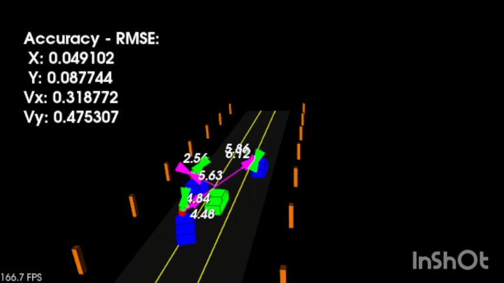

# Sensor Fusion Portfolio

## Overview

This repository demonstrates the implementation of multi-sensor tracking and state estimation algorithms for autonomous systems, focusing on radar and lidar fusion using Extended and Unscented Kalman Filters.  
The work reflects a system-level approach to tracking, including measurement modeling, nonlinear estimation, and integration into a broader tracking pipeline, with future extensions toward multi-object tracking and environment mapping.

## Sensor Fusion Approach in This Portfolio

This portfolio demonstrates sensor fusion across different levels:

- **EKF (Extended Kalman Filter)**  
  Dataset-driven estimation using linearization (Jacobian) for nonlinear radar measurements. Focus on correctness and RMSE evaluation.

- **UKF (Unscented Kalman Filter)**  
  Nonlinear estimation using sigma points with a PCL-based simulation environment. Focus on system behavior and visualization.

- **Radar-Camera Fusion**  
  Real-time multi-sensor integration combining perception and tracking.

This progression reflects increasing system complexity:
EKF → UKF → Multi-sensor fusion system.

## Tracking System Extension (Concept)
- Designed as part of a broader tracking pipeline: sensor → measurement → data association → state estimation (EKF/UKF) → track management
- Measurements from radar/lidar are associated to tracked objects using gating and nearest-neighbor concepts
- State estimation is performed using nonlinear filters (EKF/UKF) for robust tracking under sensor noise
- Track lifecycle management includes initialization, update, and deletion based on measurement consistency
- Designed to scale toward multi-object tracking and integration with mapping modules (e.g., occupancy grids)

**Tracking Pipeline Overview:**

Radar / Lidar → Measurement Processing → Data Association → EKF / UKF → Track Management → (Future: Occupancy Grid Mapping)

## ⭐ Featured Project — Real-Time Radar-Camera Fusion (C++)

A real-time C++ prototype for multi-object tracking and sensor fusion using
camera detection, Kalman filtering, and EKF-based radar updates.

### What I implemented
- Real-time multi-object tracking in C++
- Kalman filter (constant velocity model)
- EKF radar update (range + angle)
- Camera-radar association
- Detection filtering and tracking stabilization

### Engineering Decisions
- Used motion detection for real-time performance on CPU
- Integrated YOLO as optional detector (higher accuracy, lower FPS)
- Used Kalman filter to maintain tracking between detections

### Key Features
- Motion-based object detection (real-time)
- Multi-object tracking with persistent IDs
- Constant-velocity Kalman filter
- EKF radar update (range + angle)
- Simulated radar measurements
- Optional YOLO detector (OpenCV DNN)

### Tech Stack
C++, OpenCV, CMake, Visual Studio

### Project repo Link
🔗 Repo: https://github.com/Vaiy108/radar-camera-fusion

---

## Core Filtering & Estimation Projects

### Unscented Kalman Filter (UKF)
This project builds the theoretical foundation for the real-time
radar-camera fusion system implemented above.

🔗 Project link: [unscented-kalman-filter](https://github.com/Vaiy108/sensor-fusion-portfolio/tree/main/unscented-kalman-filter)

Key concepts:
- Nonlinear state estimation
- Sigma points (unscented transform)
- Radar + lidar fusion

### Overview

Implemented an Unscented Kalman Filter (UKF) to fuse radar and lidar measurements
for tracking a moving object under nonlinear motion (CTRV model).

The UKF improves over EKF by avoiding linearization and instead propagating
sigma points through nonlinear dynamics for better accuracy.

### What I implemented
- Full UKF pipeline (initialization, prediction, update)
- Sigma point generation and propagation
- CTRV motion model for nonlinear dynamics
- Radar update (nonlinear measurement model)
- Lidar update (linear measurement model)
- Angle normalization and numerical stability handling

---
### State Representation
State vector includes:
- position ($$p_x, p_y$$)
- velocity (v)
- yaw angle $$(\psi)$$
- yaw rate $$(\dot{\psi})$$

Motion model:  
  **CTRV (Constant Turn Rate and Velocity)**

Key components:
  - Augmented state with process noise
  - Sigma point generation using unscented transform
  - Nonlinear prediction step
  - Sensor-specific update steps:
  - Linear update (lidar)
  - Nonlinear update (radar)

---

### ⚙️ Implementation Highlights

- Full UKF pipeline:
  - Initialization from first measurement
  - Time-based prediction
  - Sensor fusion updates
- Angle normalization for stability
- Numerical safeguards (division-by-zero handling)
- Clean modular C++ design using Eigen

---

### Example Visualization

---

### Highlights of this project
- Demonstrates nonlinear sensor fusion (UKF)
- Shows probabilistic state estimation in C++
- Theoretical Foundation for real-world tracking systems

---

### Extended Kalman Filter
Sensor fusion using Jacobian-based linearization for radar and lidar measurements with dataset-driven evaluation. This project complements the UKF implementation by providing a baseline linearization-based approach for comparison.

Features:
- EKF prediction and update pipeline
- Radar nonlinear measurement handling using Jacobian
- Lidar linear update
- RMSE-based evaluation using ground-truth dataset
- C++ implementation with Eigen
- CMake build system

🔗 Project link: [extended-kalman-filter](./extended-kalman-filter)

### 🛠️ Tech Stack

- C++
- Eigen (linear algebra)
- CMake
- Git/GitHub

---

### 🧩 Skills Demonstrated

- C++
- Sensor Fusion
- Kalman Filtering (EKF / UKF)
- Nonlinear State Estimation
- Unscented Transform
- Radar & Lidar Fusion
- Linear Algebra (Eigen)
- System Modeling (CTRV)

---

## 👤 Author

**Vasan Iyer**  
Sensor Fusion / Autonomous Systems Engineer  

Focus areas:
- Sensor fusion & state estimation  
- Autonomous systems  
- Flight dynamics & control  
- Embedded systems (C++, Python)  
- UAV systems & simulation  

GitHub: https://github.com/Vaiy108

---
