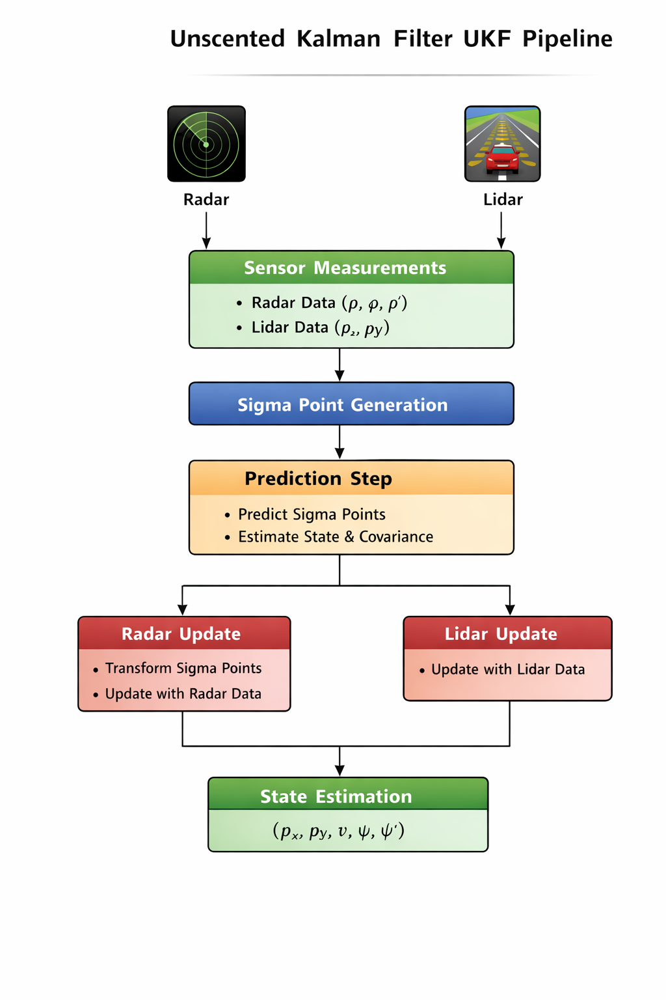
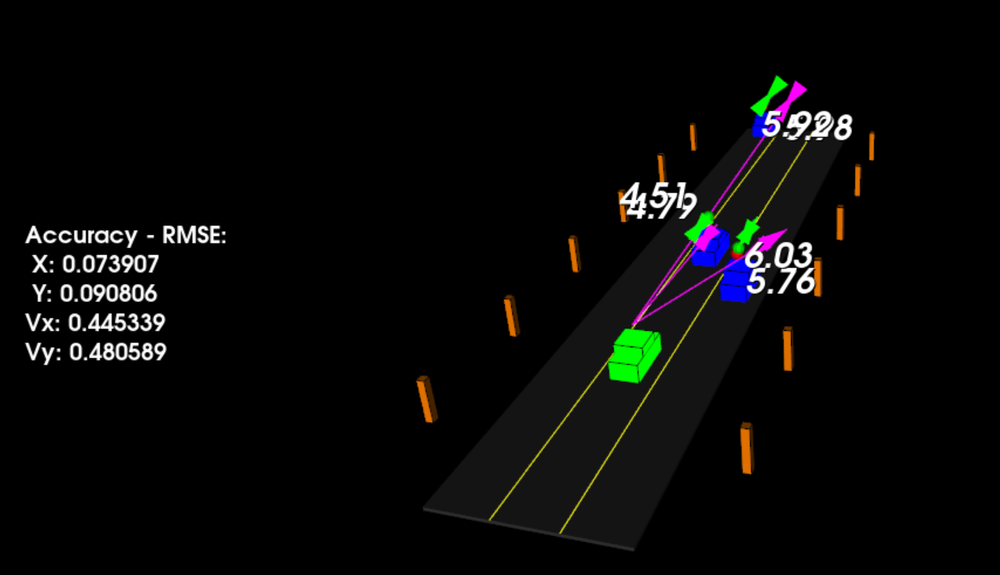

# Unscented Kalman Filter Sensor Fusion

## Overview
This project implements an Unscented Kalman Filter for tracking an object's state using lidar and radar measurements.  
The goal is to estimate the state of a moving object using nonlinear process and measurement models.

## Problem Statement
Estimate object position and motion from noisy nonlinear sensor measurements.

## Features
- Radar and lidar fusion
- CTRV motion model
- UKF prediction and update steps
- C++ implementation with CMake

## Algorithm Overview

The Unscented Kalman Filter is used to estimate the state vector:

x = [px, py, v, yaw, yaw_rate]

The filter performs two main steps:

### Prediction
1. Generate sigma points
2. Augment sigma points with process noise
3. Predict sigma points through the motion model
4. Compute predicted state mean and covariance

### Update

For each sensor measurement:

**Lidar**
- Linear position update

**Radar**
- Nonlinear measurement update using polar coordinates

Radar and lidar measurements are fused to improve state estimation.

## UKF Pipeline

The following diagram illustrates the Unscented Kalman Filter sensor fusion pipeline.

<p align="center">

</p>


## Mathematical Formulation

The Unscented Kalman Filter estimates the system state:

x = [px, py, v, ψ, ψ̇]

where:

- px, py → position
- v → velocity
- ψ → yaw angle
- ψ̇ → yaw rate

### Process Model (CTRV)

The system assumes a Constant Turn Rate and Velocity (CTRV) motion model.

If ψ̇ ≠ 0:

px_{k+1} = px + (v / ψ̇) [ sin(ψ + ψ̇Δt) − sin(ψ) ]

py_{k+1} = py + (v / ψ̇) [ −cos(ψ + ψ̇Δt) + cos(ψ) ]

ψ_{k+1} = ψ + ψ̇Δt

If ψ̇ ≈ 0:

px_{k+1} = px + v cos(ψ) Δt  
py_{k+1} = py + v sin(ψ) Δt

### Sigma Points

Sigma points are generated using:

X_i = x ± √((λ + n) P)

where:

- n → state dimension
- P → covariance matrix
- λ → scaling parameter

### Measurement Update

Radar measurements:

z = [ρ, φ, ρ̇]

where:

ρ = √(px² + py²)  
φ = atan2(py, px)  
ρ̇ = (px vx + py vy) / ρ

## Dependencies

- C++
- CMake
- Eigen3

Install Eigen:

Ubuntu:

sudo apt install libeigen3-dev

## Build Instructions

```bash
mkdir build
cd build
cmake ..
make
```
## Run the program

./ukf

## Results
The filter estimates object position and velocity using radar and lidar sensor fusion.

### Tracking Visualization



## 💡 Skills Demonstrated
- Sensor fusion
- Unscented Kalman Filter implementation
- Nonlinear state estimation
- Radar and lidar measurement modeling
- C++ numerical programming with Eigen
- CMake project configuration

## 📂 Project Structure
```
unscented-kalman-filter
├── src
│ ├── main.cpp
│ ├── ukf.cpp
│ ├── ukf.h
│ └── tools.cpp
├── media
├── CMakeLists.txt
└── README.md
```


## Notes
In this version, Eigen is resolved via `find_package(Eigen3 CONFIG REQUIRED)` instead of bundling the dependency in the repository.


## Author
**Vasan Iyer**  
Embedded systems/ Autonomous systems / Sensor Fusion Engineer  
Focus: Sensor fusion, Kalman Filtering, Autonomous systems, Flight Dynamics, Flight controls, navigation, PID control, UAV systems,  Embedded Software development, C++, Python,  sensor fusion, simulation-based verification.

GitHub: https://github.com/Vaiy108
