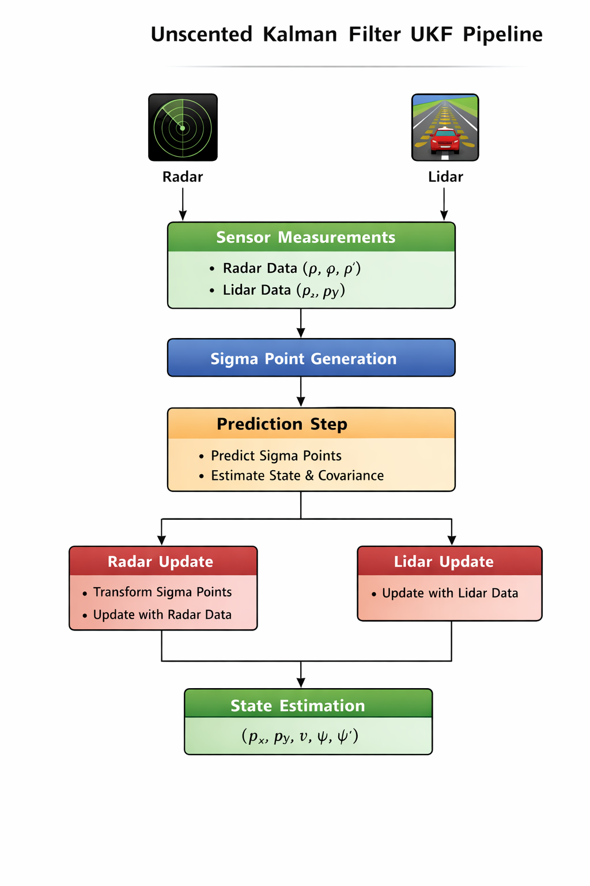
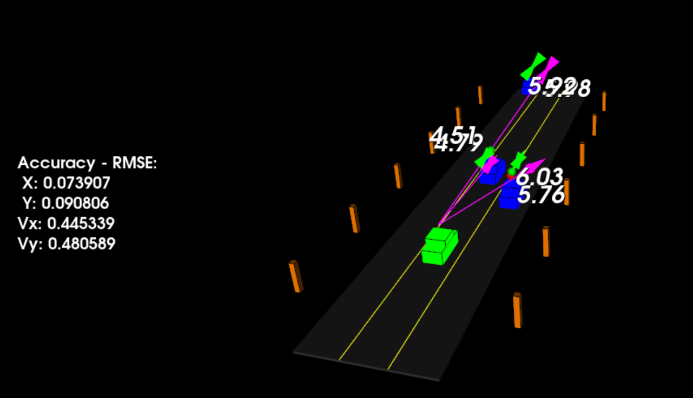

# Unscented Kalman Filter Sensor Fusion

## Overview
This project implements an **Unscented Kalman Filter (UKF)** for fusing **radar and lidar measurements** to estimate the state of a moving object in a nonlinear system.

The implementation focuses on:
- Robust nonlinear state estimation
- Sensor fusion across heterogeneous measurement models
- Numerically stable real-time filtering

## Problem
Estimate the full state of a moving object:

$$
\[
x = [p_x, p_y, v, \psi, \dot{\psi}]
\]
$$

using noisy sensor measurements:

- **Lidar** → linear position measurements $$\((p_x, p_y)\)$$  
- **Radar** → nonlinear measurements $$\((\rho, \phi, \dot{\rho})\)$$

---

## Approach

### Motion Model
- **CTRV (Constant Turn Rate and Velocity)**  
- Suitable for vehicle-like motion with smooth turns

### Why UKF?
- Avoids linearization errors of EKF  
- Uses **sigma points** to better capture nonlinear transformations  

---

## Algorithm Overview

The Unscented Kalman Filter is used to estimate the state vector:

$$
\[
x = [p_x, p_y, v, \psi, \dot{\psi}]
\]
$$


## UKF Pipeline

The following diagram illustrates the Unscented Kalman Filter sensor fusion pipeline.

<p align="center">

</p>

The filter performs two main steps:
### Prediction Step
- Augment state with process noise
- Generate sigma points
- Propagate through CTRV model
- Recover predicted mean and covariance

### Update Step

#### Lidar (Linear)
- Direct position update using standard Kalman equations

#### Radar (Nonlinear)
- Transform sigma points into measurement space
- Normalize angles to maintain consistency
- Apply unscented update  
##### Radar and lidar measurements are fused to improve state estimation.
---

## 🔧 Design Decisions

- **CTRV Motion Model Selection**  
  Chosen to capture nonlinear vehicle motion (constant turn rate and velocity), which better reflects real-world dynamics compared to linear models.

- **UKF over EKF**  
  Used UKF to avoid linearization errors and improve accuracy for nonlinear radar measurements, especially in scenarios with high curvature motion.

- **Radar vs Lidar Handling**  
  Lidar uses a linear update, while radar requires nonlinear transformation due to polar measurements.
  
- **Radar Nonlinearity Handling**  
  Incorporated radar measurements (range, angle, range rate) directly using sigma points, avoiding Jacobian computation and improving numerical stability.

- **Angle Normalization**  
  Implemented to prevent discontinuities in yaw and bearing.

- **Noise Tuning**  
  Process and measurement noise parameters were tuned empirically to balance responsiveness and stability under sensor noise.

- **Initialization Strategy**  
  Radar initializes velocity using range rate, while lidar initializes velocity as zero.

- **Numerical Stability**  
  Safeguards added to avoid division by zero and instability in angle calculations.

- **Limitations**  
  Assumes constant turn rate and velocity; performance may degrade under abrupt maneuvers or highly dynamic motion.

---

## Mathematical Formulation

### State Definition: The Unscented Kalman Filter estimates the system state:

$$
\[
x = [p_x, p_y, v, \psi, \dot{\psi}]
\]
$$

where:

- $$p_x, p_y$$ → position
- v → velocity
- $$\psi$$ → yaw angle
- $$\dot{\psi}$$→ yaw rate

### CTRV Process Model

The system assumes a Constant Turn Rate and Velocity (CTRV) motion model.

If $$\( \dot{\psi} \neq 0 \)$$:

$$
p_{x,k+1} = p_x + \frac{v}{\dot{\psi}} [\sin(\psi + \dot{\psi}\Delta t) - \sin(\psi)]
$$

$$
p_{y,k+1} = p_y + \frac{v}{\dot{\psi}} [-\cos(\psi + \dot{\psi}\Delta t) + \cos(\psi)]
$$

$$
\psi_{k+1} = \psi + {\dot{\psi}}\Delta t
$$

If $$\( \dot{\psi} \approx 0 \)$$:

$$
p_{x,k+1} = p_x + v \cos(\psi)\Delta t
$$

$$
p_{y,k+1} = p_y + v \sin(\psi)\Delta t
$$

---

### Sigma Points

Sigma points are generated using:

$$
X_i = x \pm \sqrt{(\lambda + n)P}
$$

where:

- n → state dimension
- P → covariance matrix
- λ → scaling parameter

### Measurement Update

### Radar Measurement Model:

$$
z = [\rho, \phi, \dot{\rho}]
$$

where:

$$
\rho = \sqrt{p_x^2 + p_y^2}
$$

$$
\phi = \tan^{-1}(p_y / p_x)
$$

$$
\dot{\rho} = \frac{p_x v_x + p_y v_y}{\rho}
$$

---

## Dependencies

- C++
- CMake
- Eigen3

Install Eigen:

Ubuntu:

sudo apt install libeigen3-dev

## Build Instructions

```bash
mkdir build
cd build
cmake ..
make
```


## Results

### Tracking Visualization
<p align="center">

</p>

### Performance (RMSE)

> 
- px: 0.06
- py: 0.10
- vx: 0.42
- vy: 0.63
>
- Stable tracking under nonlinear motion
- Smooth trajectory estimation
- Effective fusion of radar and lidar data

---

### Typical RMSE Accuracy values for position and velocity
<p align="center">

</p>

## My Contribution

- Implemented full UKF pipeline (prediction + update)
- Designed radar and lidar measurement models
- Implemented sigma point generation and weighting
- Handled numerical stability (angle normalization, edge cases)
- Tuned process noise parameters for stable tracking
- Structured clean, modular C++ implementation


## 💡 Skills Demonstrated
- Sensor fusion
- Unscented Kalman Filter implementation
- Nonlinear state estimation
- Radar and lidar measurement modeling
- C++ numerical programming with Eigen
- CMake project configuration

## 🛠️ Tech Stack

- C++
- Eigen (linear algebra)
- CMake

---

## 📂 Project Structure
```
unscented-kalman-filter
├── src
│ ├── main.cpp
│ ├── ukf.cpp
│ ├── ukf.h
│ └── tools.cpp
├── media
├── CMakeLists.txt
└── README.md
```

## Key Learnings

- Practical implementation of nonlinear state estimation
- Trade-offs between EKF and UKF
- Importance of angle normalization in tracking systems
- Handling real-world sensor noise and uncertainty
- Designing stable estimation pipelines for autonomous systems

---

## Notes
In this version, Eigen is resolved via `find_package(Eigen3 CONFIG REQUIRED)` instead of bundling the dependency in the repository.

## EKF vs UKF

- **EKF**: Uses Jacobian-based linearization → computationally efficient but less accurate for strong nonlinearities
- **UKF**: Uses sigma points → better nonlinear estimation at higher computational cost

In this portfolio:
- EKF demonstrates dataset-driven validation and RMSE evaluation
- UKF demonstrates nonlinear behavior in a simulation environment

## Author
**Vasan Iyer**  
Embedded systems/ Sensor Fusion / Autonomous Systems Engineer  

Focus:
- Sensor fusion & state estimation  
- Autonomous systems  
- Flight dynamics & control  
- Embedded systems (C++, Python)  
- UAV systems & simulation  

GitHub: https://github.com/Vaiy108
